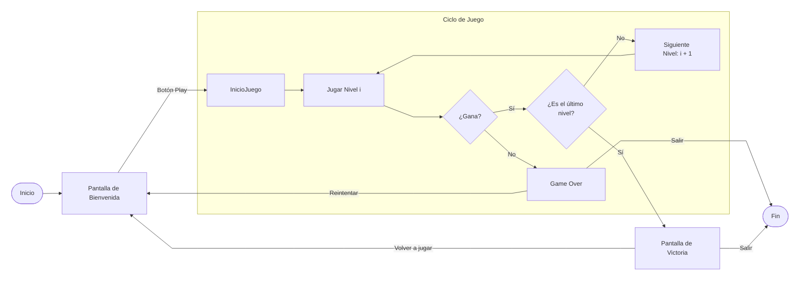
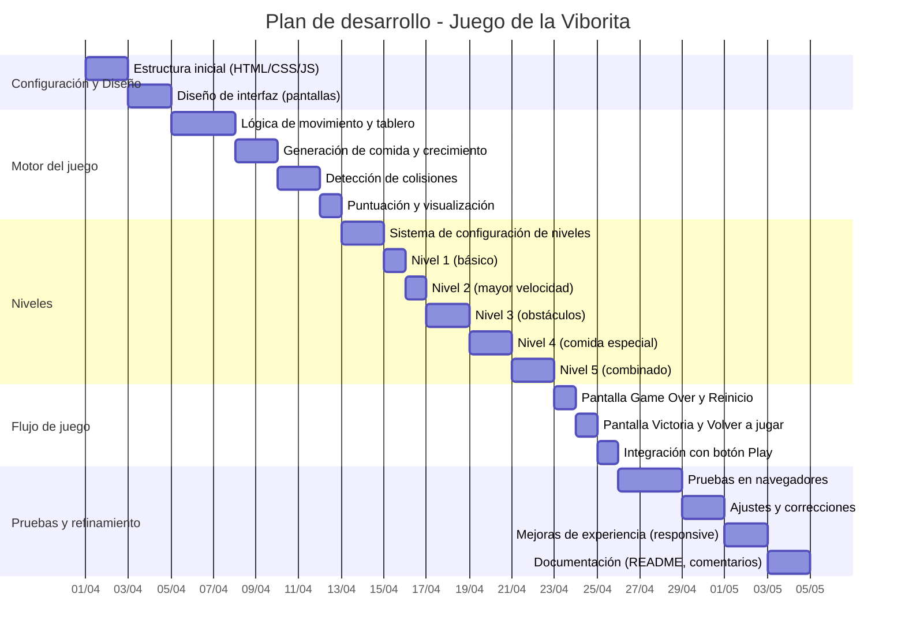

# Viborita.js


Un juego clásico de la viborita (Snake) desarrollado con JavaScript puro, sin dependencias externas, pero con el entorno de desarrollo moderno de Vite. Incluye cinco niveles de dificultad progresiva, un botón de inicio y una experiencia de juego fluida directamente en el navegador.

## 📖 Descripción

Revive la nostalgia del Snake con este juego minimalista pero desafiante. Controla una serpiente que crece al comer comida, evita chocar contra las paredes, tu propio cuerpo y los obstáculos. Con cinco niveles cuidadosamente diseñados, la dificultad aumenta gradualmente para mantener el interés. Ideal para jugar rápidamente desde cualquier navegador moderno.

## ✨ Características

_En desarrollo_

<!--
- **Juego clásico de Snake** con controles intuitivos (flechas del teclado).
- **Cinco niveles** con diferentes configuraciones: tamaño del tablero, velocidad, obstáculos y comida especial.
- **Progresión automática**: al completar un nivel, pasas al siguiente sin interrupciones.
- **Pantallas de inicio, Game Over y Victoria** con botones para reiniciar o volver a jugar.
- **Puntuación y nivel actual** visibles durante la partida.
- **Sin dependencias externas de runtime**: solo JavaScript vanilla, aunque usa Vite para el entorno de desarrollo.
- **Recarga rápida (HMR)** gracias a Vite.
-->

## 🎮 Cómo jugar

1. Inicia el servidor de desarrollo (ver instrucciones abajo).
2. Abre la URL que Vite te proporcione (normalmente `http://localhost:5173`).
3. Haz clic en el botón **Play** para comenzar desde el Nivel 1.
4. Usa las **flechas del teclado** (← ↑ → ↓) para mover la viborita.
5. Come la comida roja para crecer y sumar puntos.
6. Evita chocar contra:
   - Las paredes del tablero.
   - Tu propio cuerpo.
   - Los obstáculos (presentes en niveles avanzados).
7. Completa el objetivo de cada nivel (cantidad de comida) para avanzar al siguiente.
8. Si pierdes, haz clic en **Reiniciar** para volver a empezar desde el Nivel 1.
9. Si completas los cinco niveles, ¡habrás ganado! Presiona **Volver a jugar** para intentarlo de nuevo.

## 🛠️ Tecnologías utilizadas

- **Vite**: Entorno de desarrollo y empaquetado (solo en desarrollo, el juego final es estático).
- **HTML5**: Estructura de la aplicación.
- **CSS3**: Estilos y diseño responsive.
- **JavaScript (ES6+)**: Toda la lógica del juego, sin librerías externas.

## 🚀 Instalación y uso local

### Requisitos previos

- [Node.js](https://nodejs.org/) (versión 14 o superior)
- npm (incluido con Node.js) o yarn

### Pasos

1. Clona este repositorio:
   ```bash
   git clone https://github.com/RicJDev/ViboritaJS.git
   ```
2. Navega a la carpeta del proyecto:
   ```bash
   cd ViboritaJS
   ```
3. Instala las dependencias (aunque el juego no tiene dependencias de runtime, Vite sí las necesita para el desarrollo):
   ```bash
   npm install
   ```
4. Inicia el servidor de desarrollo:
   ```bash
   npm run dev
   ```
5. Abre tu navegador en la dirección que aparecerá en la terminal (normalmente `http://localhost:5173`).

### Construir para producción

Si deseas generar los archivos estáticos para desplegar en un servidor web:

```bash
npm run build
```

## 🔄 Diagrama de flujo del juego

El siguiente diagrama muestra la experiencia del usuario a través de la aplicación:



## 📅 Plan de desarrollo (Diagrama de Gantt)

El proyecto se desarrolló en un mes siguiendo la planificación que se muestra a continuación:



## 🤝 Contribuciones

Las contribuciones son bienvenidas. Si deseas mejorar el juego, sigue estos pasos:

1. Haz un fork del proyecto.
2. Crea una rama para tu función (`git switch -c feature/nueva-funcion`).
3. Realiza tus cambios y haz commit (`git commit -am 'Añade nueva función'`).
4. Sube la rama (`git push origin feature/nueva-funcion`).
5. Abre un Pull Request.

Por favor, asegúrate de que tu código siga las buenas prácticas y esté bien comentado.

**¡Disfruta del juego!** 🐍
