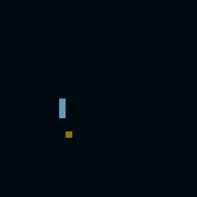

# Viborita.js

Un juego simple tipo Snake. Inspirado en un jueguito de MsDOS, fue desarrollado con JavaSript sin usar dependencias 🤘

## ¿Cómo surgió este proyecto?

<div align="center">



</div>

Estaba yo practicando mi lógica con un mini juego del cuál grabé una _"demo"_ (nótense las comillas) y de alguna manera terminó convirtiéndose en una idea más grande... o al menos, más completa.

## ¿Cómo está construido?

Toda la magia es posible gracias a la etiqueta canvas dentro de mi html.

```html
<body>
  <canvas></canvas>
</body>
```

Esta contiene una serie de metodos que permiten dibujar en ella. De forma general, se usa de la siguiente manera:

```js
const canvas = document.querySelector('canvas')
const context = canvas.getContext('2d')
```

Y es el objeto `context` el que permite dibujar en el lienzo.

Ya lo demás sería agregar una lógica que gestione los estados del juego y el input del jugador.